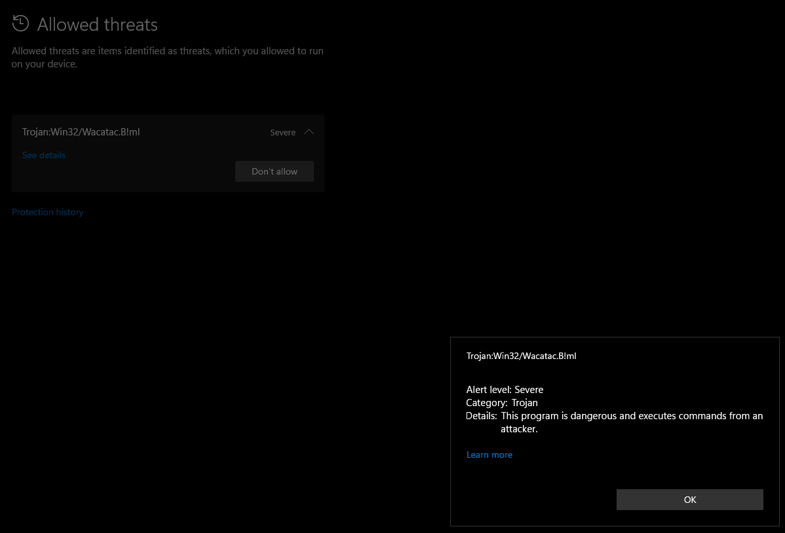

# Gfeed

Convert your GitHub star repositories to RSS feed (opml).

## Usage

Binary files are available in the release page.

```bash
usage: gfeed.py [-h] (--osmos | --opml) [--debug]

options:
  -h, --help  show this help message and exit
  --osmos     Export github star repo(s) for osmosfeed.
  --opml      Export github star repo(s) for RSS application as opml file.
  --debug     More verbose output.
```

> [!IMPORTANT]
> It is possible that windows system might flag executable binary as virus, but it is not. It just an outcome of `pyinstaller` binary.


